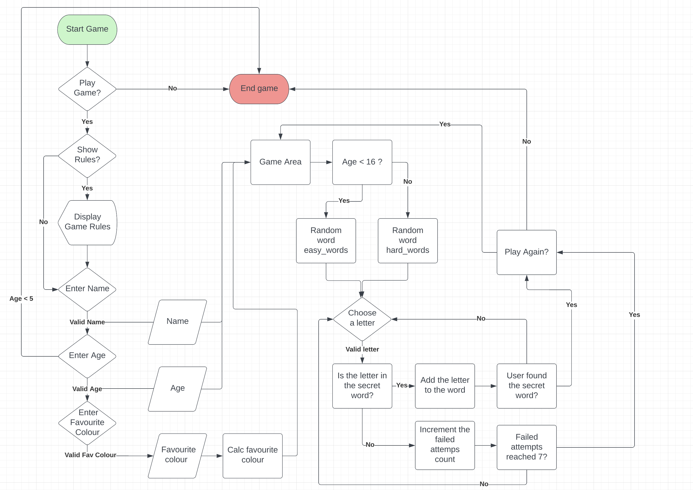
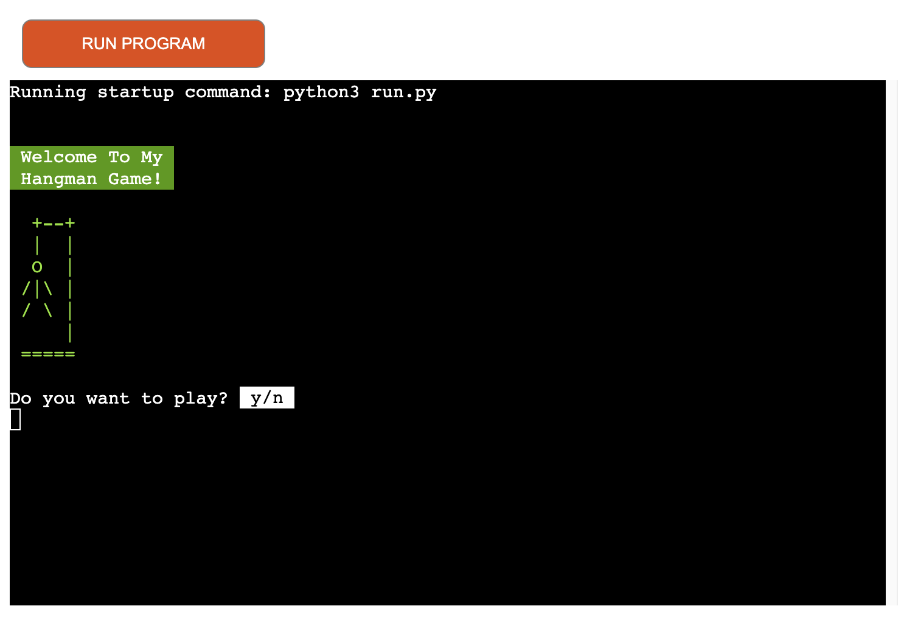
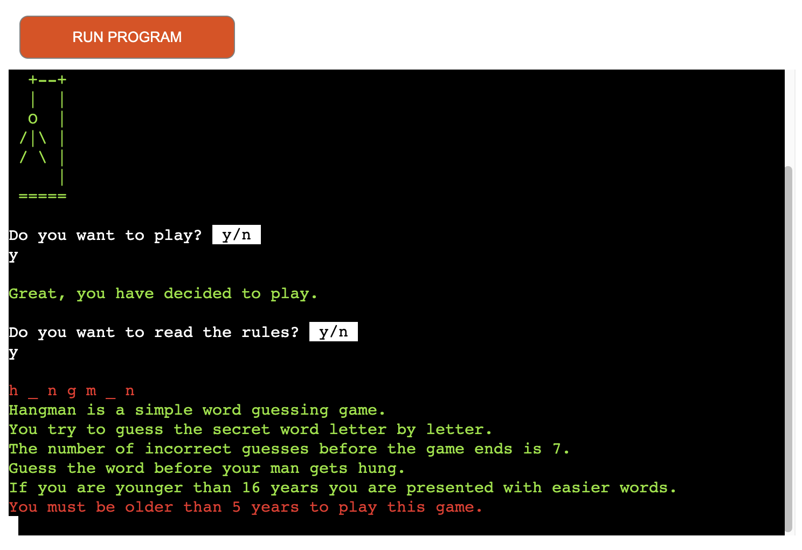
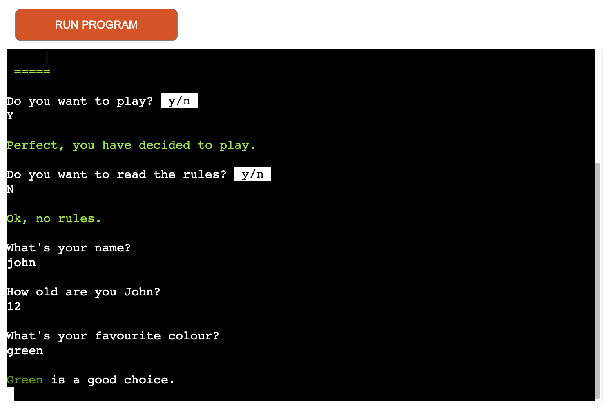
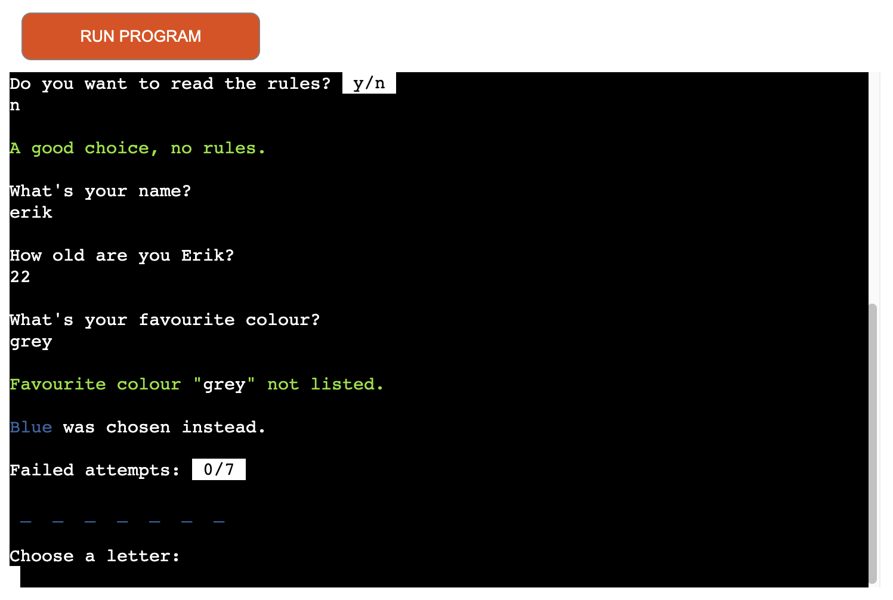
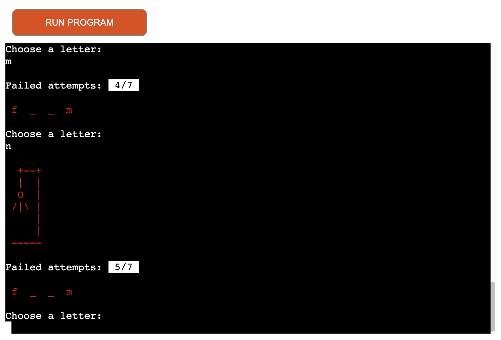
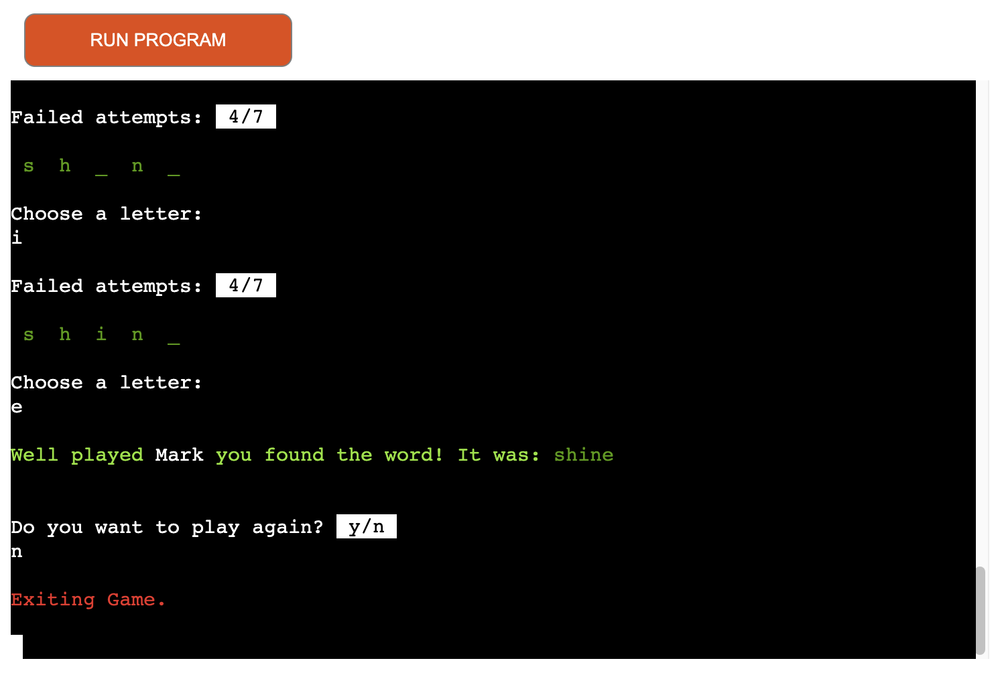
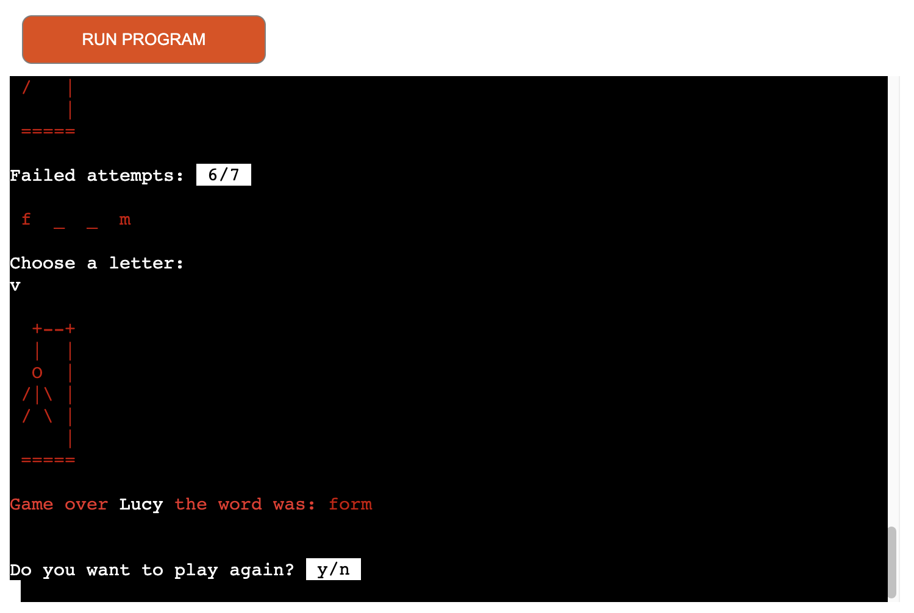
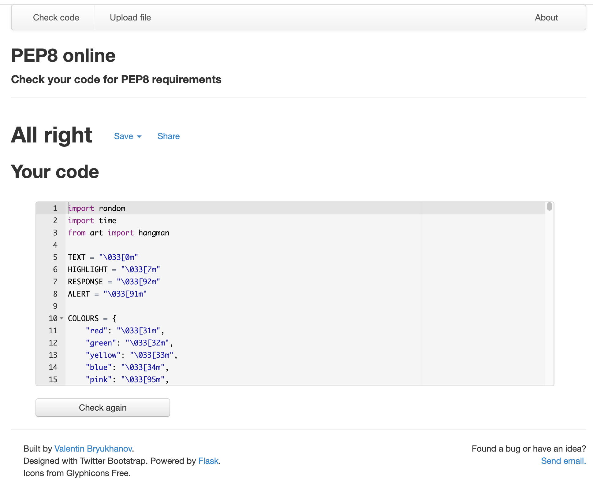

# My Hangman Game

This is my third milestone assignment with Code Institute. Hangman game is a Python terminal game, which runs in the Code Institute mock terminal on Heroku.
This is a classic hangman game, where the user tries to guess the secret word letter by letter.
The number of incorrect guesses before the game ends is 7.

This site is targeted toward people who have an interest in simple word guessing games and Python.

[View the live project here.](https://hangman-game-mittnamnkenny.herokuapp.com/)

##  User Experience (UX)

- ### User stories

    -   #### As a User, I want to be able to:

        1. Clearly understand how to navigate and start the game.
        2. Easily find instructions on how to play the game.
        3. Understand what input is required to proceed and that any exception is returned with a message to the user without causing the game to crash.
        4. Clearly see the number of incorrect guesses before the game ends.
        5. Clearly see what the secret word was if the user fails to guess it before the game ends.
        6. Continue playing the game once the game has finished without having to reenter the initial inputs from when the game started.
        7. Have a fun time playing the game and that it functions as expected.

## Flow chart
  - To explain the game logic, I created a flow chart using Lucidchart:

    

## Features

### Existing Features

#### 1. Welcome message

  - This is displayed when the game starts.
  - It will provide a welcome message to the user together with the ASCII hangman.
  - Then the user will then be prompted to start the game.

  - The user can choose: 
      - (y) - for yes - continue.
      - (n) - for no - closing the game.

    An error message informs the user if their entry is not in the correct format: ”That is not a valid option, Please try again.” The user must enter (y) to continue with the game.

    

#### 2. Rules

  - After the user has decided to play the game, the user will be asked if they wish to read the rules before proceeding:

  - The user can choose: 
      - (y) - for yes - read the rules. 
      - (n) - for no - continue without reading the rules.

    An error message informs the user if their entry is not in the correct format: ”That is not a valid option, Please try again.” The user must enter (y) or (n) to continue.

    

#### 3. Setup

  - In the setup process the user will be asked for: name, age and favourite colour.
  ##### Name
  - The name input is used to interact with the user in various print statements.
  - The user must enter a name before proceeding, only alphabet letters, 2 characters or more is accepted.
  ##### Age
  - The age input is used to determine which random word is chosen for the game.
  - If the user's age is under 16, a word from the easier words list is presented.
  - The user must be 5 years or older to play the game.
  - The user will have to enter a number here to proceed.
  ##### Favourite colour
  - Lastly, the user will be asked for their favourite colour.
  - This is used to change the colour of the ASCII hangman.
  - If the user input matches with any key in the colours dictionary, otherwise a random colour is chosen.

  If the user enters an incorrect value in the setup process, an error message is displayed: ”That is not a valid option, Please try again.”

##### Matching Favourite colour:

##### Random Favourite colour:

#### 4. Game area

  - Once the user has finished the setup process, the game will begin. 
  - Depending on the age of the user, a random word is chosen.
  - The word to guess is represented by a row of dashes representing each letter of the word. The user will then try to guess the secret word letter by letter.
  - When the user enters a letter that is not in the secret word, the failed attempts count will increment by 1 and the terminal will print one element of the ASCII hangman.
  - The number of tries before the game ends is 7.

Only one alphabet letter is accepted or an error message is displayed: ”That is not a valid option, Please try again.”

When the user enters an already guessed letter again, the following message appears: You already tried: (letter). This will not increment the failed attempts count.
 

#### 5. Result

  - The game will end when the user guessed the secret word or failed attempts reaches 7.
  - The user will be presented with a short message and then asked to play again: Do you want to play again? y/n

  - The user can choose: 
      - (y) - for yes - this will start a new game, with initial inputs.
      - (n) - for no - closing the game.

    An error message informs the user if their entry is not in the correct format: ”That is not a valid option, Please try again.” The user must enter (y) or (n) to continue.

##### User found the word:

##### Failed attempts reached 7:

#### Additional features

  - A feedback list was created to generate random text messages; this was implemented in various print statements to make the game more interesting and improve the overall experience.

### Features Left to Implement

- This game is popular in Sweden and in the future I would like to do a translated version of this game: Hänga gubbe.

## Design

- To make this game more attractive to the user, I have used the following code to print coloured text:

  - `<TEXT = "\033[0m">`
  - `<HIGHLIGHT = "\033[7m">`
  - `<RESPONSE = "\033[92m">`
  - `<ALERT = "\033[91m">`

- The favourite colours that are listed in the game:

  -  `<"red": "\033[31m",>`
  -  `<"green": "\033[32m",>`
  -  `<"yellow": "\033[33m",>`
  -  `<"blue": "\033[34m",>`
  -  `<"pink": "\033[95m",>`
  -  `<"cyan": "\033[36m",>`
  -  `<"purple": "\033[35m">`

## Technologies Used

- Python.
- [Am I Responsive:](http://ami.responsivedesign.is) Checking the responsive.
- [PEP8:](http://pep8online.com/) Check your code for PEP8 requirements.
- [Lucidchart:](https://www.lucidchart.com/pages/) Was used to create the flow chart.
- [Writer:](https://writer.com/grammar-checker/) Free Grammar Check.
- [Git](https://git-scm.com/) Git was used for version control by utilizing the Gitpod terminal to commit to Git and Push to GitHub.
- [GitHub:](https://github.com/) GitHub is used to store the projects code after being pushed from Git.
- [Heroku:](https://dashboard.heroku.com/) for deployment of the application.

## Testing

### Validator Testing 

PEP8 Online linter (Python validator)
The code passed without any errors.

- PEP8 online

### Functionality

| ID | Test Label                              | Test Action                                                                                                                                                                                | Expected Outcome                                                                                                                                                                                                                                                                                                                                                                                                                                                       | Test Outcome                                                                        |                                                                                                                                                                                                                                                                                                            
|----|---------------------------------------- |--------------------------------------------------------------------------------------------------------------------------------------------------------------------------------------------|------------------------------------------------------------------------------------------------------------------------------------------------------------------------------------------------------------------------------------------------------------------------------------------------------------------------------------------------------------------------------------------------------------------------------------------------------------------------|-------------------------------------------------------------------------------------|
|  1 | Welcome To My Hangman Game!             | Run program                                                                                                                                                                                | The user is presented with a welcome message and the ASCII hangman. The user is then prompted to start the game.                                                                                                                                                                                                                                                                                                                                                       | PASS                                                                                |                                                                                                                                                                                                                                                                                                                                                                                                                                                                                                                                                                                                                       
|  2 | Start / Do you want to play? y/n        | User is required to input (y or Y) / (n or N), invalid input will result in an error message to the user.                                                                                  | (y or Y) - The user is presented with the following message: (feedback) you have decided to play. (n or N) - The user is presented with the following message: Exiting Game. - The game closes. An error message informs the user if their entry is not in the correct format: ”That is not a valid option, Please try again.”                                                                                                                                         | PASS                                                                                |                                                                                                                                                                                                                                                                                                           
|  3 | Rules / Read the rules? y/n             | User is required to input (y or Y) / (n or N), invalid input will result in an error message to the user.                                                                                  | (y or Y) - The user is presented with the rules of the game. (n or N) - The user is presented with the following message: (feedback), no rules. An error message informs the user if their entry is not in the correct format: ”That is not a valid option, Please try again.”                                                                                                                                                                                         | PASS                                                                                |                                                                                                                                                                                                                                                                                                                                                                                                                                                                                                                                                                                                                       
|  4 | Setup / Name and Favourite colour       | User is required to input name and favourite colour only alphabet letters, 2 characters or more is accepted.                                                                               | The user is then prompted to enter name and favourite colour. A short print statement will be presented to the user after each validated input. An error message informs the user if their entry is not in the correct format: ”That is not a valid option, Please try again.”                                                                                                                                                                                         | PASS                                                                                |                                                                                                                                                                                                                                                                                                                                                                                                                                                                                                                                                                                                                       
|  5 | Setup / Age                             | User is required to input age, user must enter a number here to proceed.                                                                                                                   | The user is prompted to enter age. A short print statement will be presented to the user after validated age input. An error message informs the user if their entry is not in the correct format: ”That is not a valid option, Please try again.” If age < 5 the following message will be presented to the user: You are too young to play this game! - The game closes.                                                                                             | PASS                                                                                |                                                                                                                                                                                                                                                                                                                                                                                                                                                                                                                                                                                                                       
|  6 | Display / Favourite colour              | If the user input matches with any key in the colours dictionary otherwise a random colour is chosen. Used to display the ASCII hangman in different colours depending on user input.      | User choice matches with a key in the colours dictionary, the following message is presented: (colour) is (feedback). Otherwise a random colour is chosen and the message is: (colour) not listed. (colour) was chosen instead. Both the ASCII hangman and the secret word will be printed in the chosen favourite colour.                                                                                                                                             | PASS                                                                                |                                                                                                                                                                                                                                                                                                                                                                                                                                                                                                                                                                                                                      
|  7 | Game Area / Chosen Word                 | The word to guess is represented by a row of dashes representing each letter of the word. The difficulty of the word depends on age input.                                                 | If user age is below 16 years a word from the easy_words file is presented otherwise a word from hard_words file is chosen.                                                                                                                                                                                                                                                                                                                                            | PASS                                                                                |                                                                                                                                                                                                                                                                                                                                                                                                                                                                                                                                                                                                                      
|  8 | Game Area / Choose A Letter             | User is prompted to choose a letter to guess.                                                                                                                                              | Only one alphabet letter is accepted or an error message is displayed: ”That is not a valid option, Please try again.” When the user enters an already guessed letter again the following message appears: You already tried: (letter). This will not increment the failed attempts count.                                                                                                                                                                             | PASS                                                                                |                                                                                                                                                                                                                                                                                                                                                                                                                                                                                                                                                                                                                       
|  9 | Game Area / Failed Attempts             | User enters a letter that is not in the secret word to guess.                                                                                                                              | Failed Attempts count should increment by 1 and the terminal will print one element of the ASCII hangman. The number of tries before the game ends is 7.                                                                                                                                                                                                                                                                                                               | PASS                                                                                |                                                                                                                                                                                                                                                                                                                                                                                                                                                                                                                                                                                                                      
| 10 | Game Area / Result                      | The user finds the secret word or failed attempts count reaches 7.                                                                                                                         | The user is presented with a short message and what the secret word was. Then the user is prompted to play again.                                                                                                                                                                                                                                                                                                                                                      | PASS                                                                                |                                                                                                                                                                                                                                                                                                                                                                                                                                                                                                                                                                                                                       
| 11 | Result / Play Again? y/n                | User is required to input (y or Y) / (n or N), invalid input will result in an error message to the user.                                                                                  | (y or Y) - The user is presented with the following message: (feedback) you have decided to play again. - The user will be presented with a new word to guess. (n or N) - The user is presented with the following message: Exiting Game. - The game closes. An error message informs the user if their entry is not in the correct format: ”That is not a valid option, Please try again.”                                                                            | PASS                                                                                |                                                                                                                                                                                                                                                                                                                                                                                                                                                                                                                                                                                                                      

### Further Testing

  #### I have tested that:

  - All the values in the colours dictionary are displayed properly. 
  - The text colours in affected print statements are correct.
  - The new line character “\n” in the print statements is working as expected.
  - The time sleep function is working and used to add delay.
  - The feedback list is implemented correctly in chosen print statements.

### User Stories

User stories have been tested and below you can see which features support which stories:

User stories are numbered 1 to 7 and the features are:
  1. Welcome message
  2. Rules
  3. Setup
  4. Game area
  5. Result

| ID | User Stories                                                                                                                                                   | Features      |                                                                                                                                                                                                                                                                                                                                                                                                                                                                                                                                                                                                                                                                                                                                                                                                                                                                                                                                
|----|----------------------------------------------------------------------------------------------------------------------------------------------------------------|---------------|
|  1 | Clearly understand how to navigate and start the game.                                                                                                         | 1, 2, 3       | 
|  2 | Easily find instructions on how to play the game.                                                                                                              | 2             |                                                                                                                                                                                                                                                                                                                                                                                                                                                                                                                                                                                                                                                                                                                                                                                                                                                                                                                                                                                                                                                                                                                                  
|  3 | Understand what input is required to proceed and that any exception is returned with a message to the user without causing the game to crash.                  | 1, 2, 3, 4, 5 |                                                                                                                                                                                                                                                                                                                                                                                                                                                                                                                                                                                                                                                                                                                                                                                                                                                                                                                                                                                                                                                                                                                                  
|  4 | Clearly see the number of incorrect guesses before the game ends.                                                                                              | 4             |   
|  5 | Clearly see what the secret word was if the user fails to guess it before the game ends.                                                                       | 5             |                                                                                                                                                                                                                                                                                                                                                                                                                                                                                                                                                                                                                                                                                                                                                                                                                                                                                                                                                                                                                                                                                                                                  
|  6 | Continue playing the game once the game has finished without having to reenter the initial inputs from when the game started.                                  | 5             |                                                                                                                                                                                                                                                                                                                                                                                                                                                                                                                                                                                                                                                                                                                                                                                                                                                                                                                                                                                                                                                                                                                                  
|  7 | Have a fun time playing the game and that it functions as expected.                                                                                            | 1, 2, 3, 4, 5 |                                                                                                                                                                                                                                                                                                                                                                                                                                                                                                                                                                                                                                                                                                                                                                                                                                                                                                                                                                                                                                                                                                                                  

### Known bugs

- This is not a bug, but I've noticed that the background colour on the Heroku app is #000. On the GitPod terminal it is #171717.
  Therefor the text colours will look a bit different on Heroku, in my opinion it looks better with background colour #171717.

## Deployment

The site was deployed to Heroku. The steps to deploy are as follows:
  1. Log in to Heroku.
  2. Click "Create new app".
  3. Choose app name and choose a region.
  4. Click "Create app".
  5. Navigate to the "settings" tab.
  6. "Click "Reveal Config Vars".
  7. Add Config Var in Heroku's Settings. The key is PORT and the value is 8000
  8. Scroll down to "Buildpacks".
  9. Click "Add Buildpack".
  10. First add "python", click save.
  11. Second add "nodejs", click save.

### Automated Deployments from GitHub disabled by Heroku.

Follow the steps below to deploy from your Gitpod workspace:
  1. Open the terminal.
  2. command: heroku login -i
  3. Get your app name from heroku.
  4. command: heroku apps
  5. Set the heroku remote. (Replace <app_name> with your actual app name and remove the <> characters)
  6. command: heroku git:remote -a <app_name>
  7. Add and commit any changes to your code if applicable
  8. command: git add . && git commit -m "Deploy to Heroku via CLI"
  9. Push to both GitHub and Heroku
  10. command: git push origin main
  11. command: git push heroku main

## Credits

- [Am I Responsive:](http://ami.responsivedesign.is) Checking the responsive.
- [Lucidchart:](https://www.lucidchart.com/pages/) Was used to create the flow chart.
- [Writer:](https://writer.com/grammar-checker/) Free Grammar Check.
- [NeuralNine:](https://www.youtube.com/watch?v=5x6iAKdJB6U) Inspiration for creating A Simple Hangman Game in Python.
- [Stackoverflow:](https://stackoverflow.com/questions/287871/how-do-i-print-colored-text-to-the-terminal) How do I print colored text to the terminal.
- [Invent with python:](https://inventwithpython.com/invent4thed/chapter8.html) Hangman ASCII art.
- [Powerlanguage:](https://github.com/powerlanguage/word-lists/blob/master/1000-most-common-words.txt) 1000 most common words.

### Acknowledgements

- My mentor at Code Institute Brian Macharia for code review, help and feedback. Very much appreciated!
